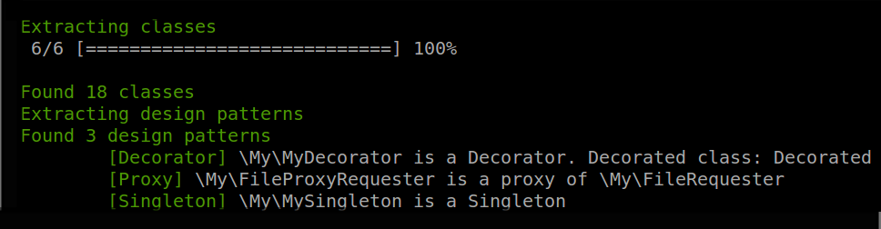

# Pattern Detector for PHP

Detects design pattern in your code

 

## Installation

    git clone https://github.com/Halleck45/DesignPatternDetector.git
    cd DesignPatternDetector
    composer install

## Usage

    ./bin/design-pattern <source-directory>

You'll get something like:

    
## Why ?

Just for fun. **This tool is only a proof of concept**. But contributions are welcome :)

## Detected patterns

Today this tool is able to detect following patterns :

+ Micro
    + Structure
+ Structural
    + Bridge
    + Decorator
    + Proxy
+ Creational
    + Singleton
+ Behavior

## License

See LICENSE file

    
